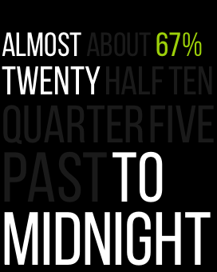
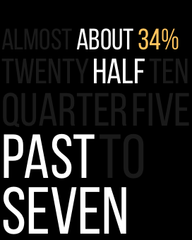
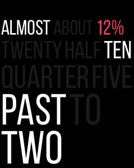

# TimeBoard - A verbose Apple Watch Face

This App / Watch face tells time with words.

  

## Features

- 5 min granularity
- Compatible with all watch models (including Series 4)
- Tendency indicators
  - `Almost`: 1 or 2 min before the indicated time
  - `About`: 1 or 2 min after the indicated time
  - `(no indicator)`: exactly the indicated time
- Battery indicator (color coded)
  - 100% to 50%: Green
  - 50% to 20%: Orange
  - Below 20%: Red
  
## Language support

:white_check_mark: English

Please keep in mind that the design depends heavily on the language and there is **no plan at the moment to add support for further localizations**. But I encourage you to fork this project and give it a try in your own language!
## Feedback

Feel free to open an issue with any bugs or suggestions!
